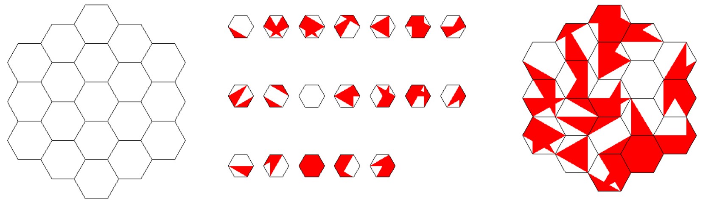

# Hexabits-solver
This is a visual solver for Hexabits puzzle. Hexabits is a puzzle game that consists of a grid in the form of a hive with each cell in the shape of a hexagon. The code randomly generates hexagon tiles equal or greater to the number of empty cells on the grid. The pattern of each hexagon comprised of two different colors. 

The objective of the puzzle is to place hexagon tiles on the board in a way that adjacent tile edges
have the same color. The image below shows an example of the tiles and the final solution to the puzzle.

## Pattern generation
To generate patterns, A hexagon is divided into all possible triangles which are formed by connecting all vertices of the hexagon to each other as well as a point at the center. The triangles then randomly are assigned a color, white or blue.

## Object recognition
### Extracting objects
The setup image is divided into the board and the tiles. The tiles portion of the images is turned to a binary image. The closed boundaries in the binary image are identified and then filled. The generated binary mask is then used to extract individual images from the color image of the tiles.

### Recognizing objects
The individual tile images are turned to a filled binary mask. Next, the outer edges of the shapes in each image is identified using the Hugh transform algorithm. Using the distances between the edges of the shape is calculated and the longest one is selected which in the case of a hexagon, it represents the distance between two parallel edges. If the distance between the two edges and the area of the shape match the property of the hexagon (A = pi * d2), then the object is identified as a hexagon.

### Pattern identification
The color patterns of hexagons are identified in order by selecting the line on the most left side of the shape. All other lines (edges of the shape) are identified in an anti-clockwise fashion. Then a region near the middle point of each line identified to determined the color of the corresponding edge.

## Solving the puzzle
The puzzle is solved using a first depth search (FDS) approach. The search starts by placing the first tile in the top-left-most cell and continues by attempting matching other tiles (this process includes rotating the tiles if necessary.
